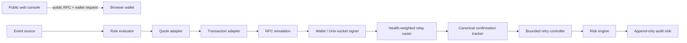

# Sunder architecture

## Trust boundaries

Sunder has three independent runtime boundaries:

1. The public React console discovers Solana Wallet Standard or EIP-1193 wallets, reads public chain state, simulates interactive test-network transactions and requests user approval. It never accepts key material.
2. The chain-agnostic engine normalizes events and applies deterministic rule, risk, retry, audit and confirmation invariants.
3. The persistent executor runs on a private host. It sends unsigned payloads and an exact manifest to a policy-limited signer over a Unix socket; the signer never receives an HTTP request from the web UI.

Relay acceptance is recorded as `submitted`. Only Solana `confirmed`/`finalized` signature status or a canonical successful EVM receipt at the required depth can produce a successful execution result. Reverted, expired, disappeared or reorged observations fail.

## Shared engine

`packages/sniper-engine` defines typed `ChainAdapter`, `WalletAdapter`, `QuoteAdapter`, `TransactionAdapter`, `RelayAdapter` and `ConfirmationAdapter` interfaces. Its shared core provides:

- source-cursor deduplication for concurrent and repeated delivery;
- safe bounded regular expressions and truncated event text;
- target allow/deny lists, media/account/keyword matching and cooldowns;
- per-rule and per-network daily spend envelopes;
- startup hydration of canonical confirmation caps, cooldowns and daily spend from the append-only executor audit, so a process restart cannot reset an armed rule's first-three boundary;
- quote expiry, slippage and price-impact checks;
- default Mainnet locks and a live kill switch;
- bounded retries with Solana refresh or EVM nonce-preserving replacement;
- structured audit records for every pipeline stage.

## Solana adapter

`packages/chain-solana` uses the official Pump SDK for bonding-curve quotes and buy instructions. It obtains a current blockhash, adds compute-unit controls, accepts a tip only with an explicitly configured recipient, simulates the exact unsigned transaction and supports standard RPC, Jito, Nozomi and 0slot relay adapters. The confirmation tracker combines subscription/polling with blockhash-expiry detection.

The browser verification path uses `@solana/client` and `@solana/react-hooks`: connect, balance, exact one-lamport Devnet self-transfer, unsigned simulation, signed simulation where possible, wallet submission and explicit RPC polling. The return value from transaction submission is not treated as confirmation.

The Solana Mainnet trading terminal is a separate interactive, wallet-owned path:

- Jupiter Tokens V2 `recent`/`search` on the public-lite host supplies real new-pool discovery and bounded market metadata without exposing a developer key in browser code; malformed individual records are discarded without fabricating replacements. The anonymous feed is best-effort, while a server-side key-backed gateway is required for a production data SLA.
- A confirmed `logsSubscribe` on the official Pump program address decodes the current official `TradeEvent` discriminator/prefix and filters the selected mint. This powers the live tape and exposes actual protocol/creator fee basis points. A live PublicNode A/B probe observed `98` matching program-stream events but `0` notifications when the `mentions` filter was changed to the event mint, because that mint is not reliably present in the outer transaction account list; the program subscription plus decoded-mint filter is therefore intentional.
- Jupiter Swap V2 `build` is requested with wrapped SOL, the selected mint, an exact amount, the connected taker and `platformFeeBps=0`.
- API instructions and lookup tables are validated with Zod, converted to a versioned transaction, and simulated without a signature to size compute units. A reduced compute limit is rebuilt and simulated exactly; if the maximum limit remains unchanged, the already-exact first simulation is reused.
- Wallet Standard signs the exact prepared transaction. Sunder runs signed simulation, submits with preflight, polls signature status and blockhash expiry, fetches `getTransaction`, validates the expected wallet/mint and derives exact SOL/token/fee/rent deltas.
- Local PnL includes only those canonical confirmed deltas. Unvalued inventory never appears as realized profit. The first-three cap is enforced by the shared risk core and wallet-basket planner; watch-only addresses cannot become signers.

The browser fallback uses PublicNode HTTP/WebSocket endpoints because both were rendered and exercised with browser CORS/WS. It is best-effort public infrastructure, not a production SLA; funded operation should set a project-scoped browser-safe RPC. Persistent or unattended Mainnet execution remains isolated behind the executor signer, funding, budget, relay and operator gates.

## Ethereum/EVM adapter

`packages/chain-evm` uses viem-compatible RPC primitives and explicit EIP-1559 drafts. A pending nonce is preserved across replacement while `maxFeePerGas` and `maxPriorityFeePerGas` receive the configured bounded bump. `eth_call` and `estimateGas` both pass before signing.

Venue routing is typed and version-aware:

- V2: official Mainnet and Sepolia Router02 `getAmountsOut` and exact-input swap encoders, with wrapped-native path endpoint enforcement.
- V3: official QuoterV2 and SwapRouter02 exact-input-single quote/build paths.
- V4: official V4 Quoter pool-key quote and current Universal Router V2.1.1 `V4_SWAP` encoding with `SWAP_EXACT_IN_SINGLE`, input-bounded `SETTLE_ALL` and minimum-output-bounded `TAKE_ALL` actions. The pinned `IV4Router.ExactInputSingleParams` includes `minHopPriceX36`.
- Auto: runs all viable configured venues and selects the greatest valid output; the transaction router is derived from the winning quote and rejects a venue mismatch.

Token approvals remain wallet-owned. A missing ERC-20/Permit2 allowance causes exact simulation to fail instead of producing a fake ready state. V4 hook data and tick spacing are explicit event attributes, not guessed backend behavior.

The confirmation adapter validates receipt status, canonical block hash, required depth, finalized head when available, nonce replacement and receipt disappearance/reorg. Standard RPC and Flashbots Protect/private submission are separate relay adapters.

The browser verification path connects through wagmi/viem, reads balance, runs `eth_call` and `estimateGas`, requests an EIP-1559 zero-value Sepolia self-transfer, waits for two confirmations and rechecks the canonical block hash. Launch Studio also has a deterministic fixed-supply Sepolia ERC-20 deployment path with the same simulation and receipt invariant.

## Persistent executor

`packages/executor` provides:

- strict Zod environment parsing and rejection of key-material variables;
- loopback-only HTTP binding and a mode-checked bearer-token file;
- `/health`, `/ready`, relay health, execution, kill-switch and audit endpoints;
- per-network/account serialization to prevent accidental EVM nonce collision;
- restricted Unix-socket signing protocol;
- persistent mode-0600 JSONL audit;
- independent Mainnet gates for RPC, signer, private relay, public funding address, budgets, enable flag and exact operator confirmation;
- hardened systemd instance template and runbook.

The executor may be healthy while not ready. This is intentional: liveness proves the process is running; readiness proves at least one configured network passes all required gates.

## Official primary sources

- [Solana frontend integrations](https://solana.com/docs/frontend)
- [Solana retry and confirmation guidance](https://solana.com/developers/guides/advanced/retry)
- [Pump public docs](https://github.com/pump-fun/pump-public-docs)
- [Jupiter Swap API V2](https://dev.jup.ag/docs/swap)
- [Jupiter Tokens API](https://dev.jup.ag/docs/tokens)
- [PublicNode Solana RPC/WS](https://solana.publicnode.com/)
- [Jito low-latency transaction send](https://docs.jito.wtf/lowlatencytxnsend/)
- [Nozomi transaction submission](https://use.temporal.xyz/nozomi/transaction-submission)
- [0slot documentation](https://0slot.trade/docs.php)
- [EIP-1193 provider API](https://eips.ethereum.org/EIPS/eip-1193)
- [EIP-1559 transaction fee market](https://eips.ethereum.org/EIPS/eip-1559)
- [wagmi React documentation](https://wagmi.sh/react/getting-started)
- [viem documentation](https://viem.sh/)
- [Flashbots Protect overview](https://docs.flashbots.net/flashbots-protect/overview)
- [Uniswap V3 deployments](https://github.com/Uniswap/v3-periphery/blob/main/deploys.md)
- [Uniswap V4 deployments](https://github.com/Uniswap/docs/blob/main/content/protocols/v4/deployments.mdx)
- [Uniswap SDK chain addresses](https://github.com/Uniswap/sdks/blob/main/sdks/sdk-core/src/addresses.ts)
- [Pinned Universal Router deployment manifests](https://github.com/Uniswap/universal-router/tree/fa3f856951967abd7e0cf33901f6cead31eb5469/deploy-addresses)
- [Pinned V4 Router interface](https://github.com/Uniswap/v4-periphery/blob/363226d9e1e2180b67bf6857023dbaad751010c5/src/interfaces/IV4Router.sol)
- [Universal Router command definitions](https://github.com/Uniswap/universal-router/blob/dev/contracts/libraries/Commands.sol)
- [Universal Router V4 integration tests](https://github.com/Uniswap/universal-router/blob/dev/test/integration-tests/UniswapV4.test.ts)
