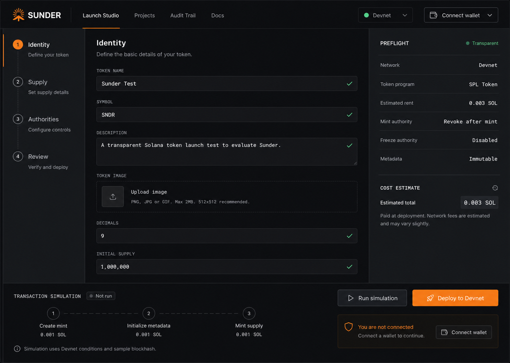
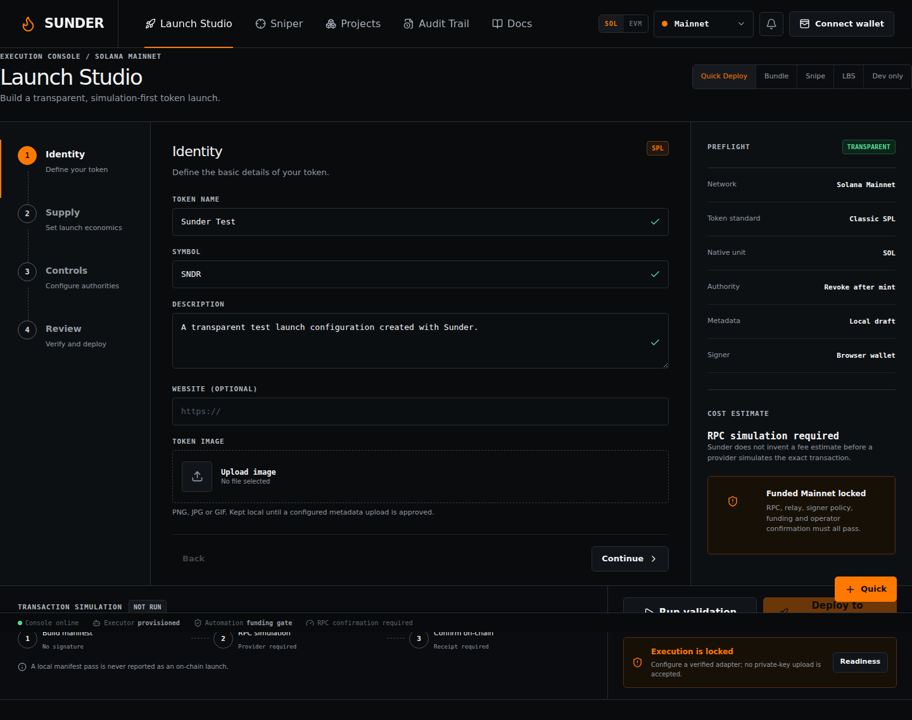
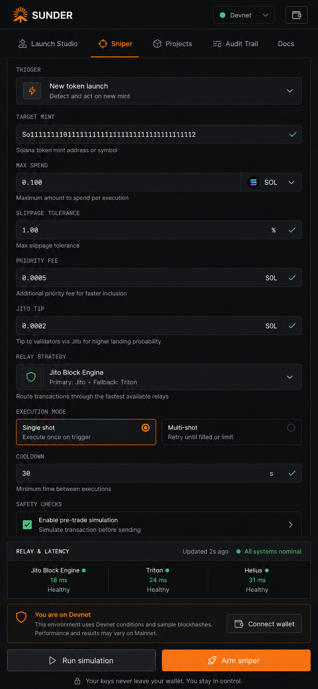
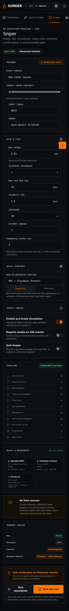

# Rendered design QA

The accepted Sunder source compositions were reviewed before implementation and compared with real Chromium renders on 2026-08-02 UTC. The result remains an operational application: dense navigation, forms, readiness panels and explicit execution states are preserved; no landing-page hero, gradients or fabricated market charts were introduced.

## Side-by-side comparison

| Accepted desktop source | Final desktop Chromium render |
|---|---|
|  |  |

| Accepted mobile source | Final mobile Chromium render |
|---|---|
|  |  |

## Evidence and findings

- Desktop project: Chrome at `1440 x 1000`; source composition `1487 x 1058`.
- Mobile project: Pixel 7 emulation at `390 x 844`; source composition `853 x 1844`.
- Browser routes checked: Dashboard, Projects, Wallets, XID, Leaders, Launch Studio, Sniper, Swap Manager, Tracker, Settings, Audit Trail and Docs.
- EVM parity checked in the render: family/network selector, Ethereum/Sepolia labels, ETH/Gwei units, Uniswap V2/V3/V4 venue selector, Flashbots relay state and funded Mainnet lock.
- Solana wallet modal checked with a real browser session: Wallet Standard absence is reported honestly, Devnet verification remains disabled without a provider, and no seed/private-key input exists.
- Mobile drawer closes with `inert` and `aria-hidden=true`, opens accessibly, exposes notifications as well as every product route, and returns to the closed state after navigation.
- `documentElement.scrollWidth <= clientWidth` passed at desktop and mobile widths across all 12 product routes. The final production-build Docs check measured `390 px <= 390 px` after correcting grid-item minimum sizing.
- Fresh browser console: no application errors. A Solana `buffer` compatibility warning found during the first pass was fixed with an explicit browser alias and then rechecked.
- Local cold-load evidence from Chrome: TTFB `2.8 ms`, FCP `1468 ms`, LCP `1784 ms`, CLS `0.0`. These are VPS-local measurements, not an internet SLA.

Additional viewport evidence:

- `artifacts/qa/final-desktop-viewport.png`
- `artifacts/qa/final-mobile-viewport.png`
- `artifacts/qa/final-mobile-wallets.png`
- `artifacts/qa/final-preview-desktop.png`
- `artifacts/qa/final-preview-mobile-drawer.png`
- `artifacts/qa/final-production-build-desktop.png`
- `artifacts/qa/final-production-build-mobile.png`
- `artifacts/qa/final-production-build-docs-mobile.png`

## Automated Browser result

Playwright ran the full two-project suite with one worker to stay inside the VPS memory envelope: **11 passed, 3 intentionally skipped** (viewport-specific evidence and desktop drag checks are skipped only where they do not apply). The suite includes permanent token-route checks, draggable terminal-panel persistence, and a controlled EIP-1193/Sepolia RPC flow that remains `submitted` until a canonical receipt is released, then verifies the exact zero-value self-transfer intent before showing `confirmed`. There were no failures. Reproduce with `npm run test:e2e`.

## Solana live terminal follow-up

The user-provided Axiom terminal was subsequently used as an equal-size `1280 x 653` source target for the Solana-first `/swap` implementation. The required same-input full-view comparison, focused trade-dock comparison, three blocked iteration passes, final production desktop/mobile captures, interaction evidence, console checks, and final result are recorded in the project-root [`design-qa.md`](../design-qa.md).

The 2026-08-02 Mainnet follow-up adds bounded confirmed Pump transaction backfill, stable per-mint market-cap calibration, permanent `/meme/<mint>?chain=sol` routes, TradingView attribution, a provisioned executor funding state, and a new combined Axiom/Sunder + mobile source/Sniper comparison at `artifacts/qa/terminal-mainnet-side-by-side.png`.
